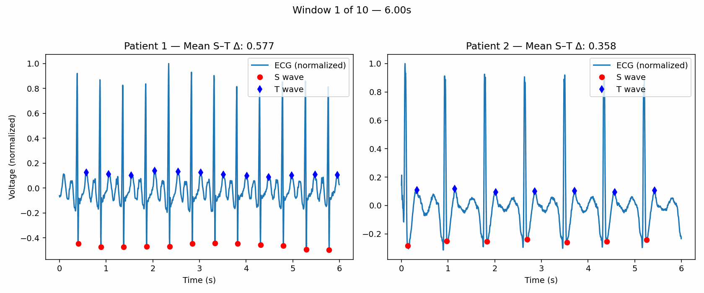

# ECG ST Segment Analysis

## Project Overview
This project analyzes filtered ECG (electrocardiogram) signals from two patients, focusing on **S–T segment voltage differences** as a marker of ventricular repolarization. The analysis uses adaptive S/T detection based on peak-finding methods and sliding window segmentation.

## Dataset
- **File:** `ecgPatientData.xlsx`  
- **Columns:**
  - `Time` (seconds)
  - `ECG Data Patient 1`
  - `ECG Data Patient 2`

## Methodology
1. **Normalization** – Each ECG segment was scaled to ±1 for relative amplitude.  
2. **Windowing** – Signals were divided into 6-second windows with 50% overlap.  
3. **Peak Detection**  
   - **R-wave**: Identified using `scipy.signal.find_peaks` with threshold ≥30% of the local max and minimum spacing of 200 ms.  
   - **S-wave**: Minimum within 0–60 ms after each R.  
   - **T-wave**: Maximum within 30–300 ms after each S.  
4. **S–T Delta** – Computed as the mean difference between S and T amplitudes per window.  
5. **Visualization** – The first 10 windows were rendered side-by-side for both patients and combined into an animated GIF for review.

## Results
- **Patient 1**: Mean S–T Δ ranged from **~0.500 to 0.650**  
- **Patient 2**: Mean S–T Δ ranged from **~0.335 to 0.390**

## Visualization

## Conclusions
- Patient 1 consistently shows a **larger S–T voltage difference**, suggesting more pronounced ventricular repolarization. This may reflect relative **ST elevation** or augmented T-wave amplitude, which can occur with increased myocardial workload or ischemic stress.  
- Patient 2 demonstrates **smaller and more stable S–T differences**, consistent with more typical repolarization physiology.  
- The observed ~0.15–0.25 higher S–T difference in Patient 1 relative to Patient 2 may signal **underlying variation in ventricular recovery** dynamics between the two patients.

## Caveats
- Only two patients were analyzed — results are not generalizable.  
- Normalization to ±1 removes absolute voltage context; differences are **relative** rather than clinical voltages in millivolts.  
- Electrode placement, noise, and filtering could influence peak detection accuracy.  
- The analysis is **illustrative, not diagnostic** — no clinical outcomes or labels are included.  
